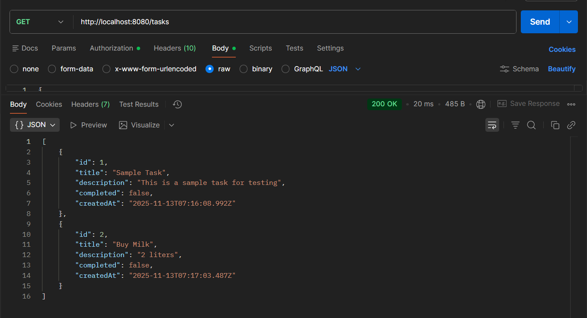
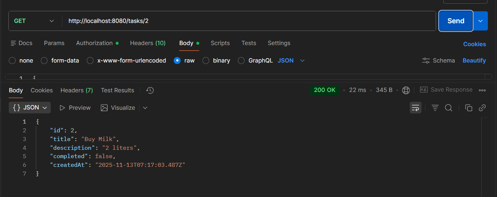
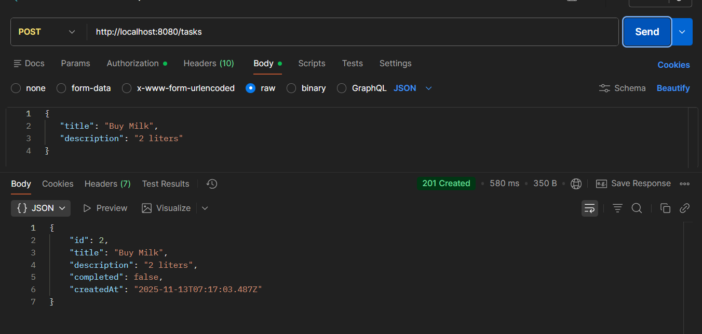
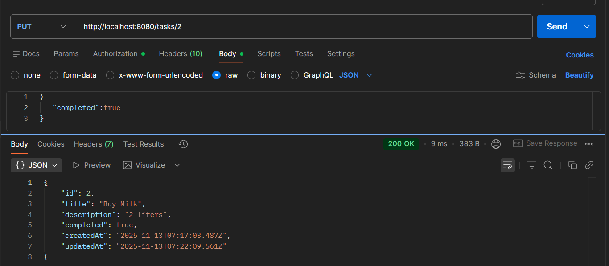
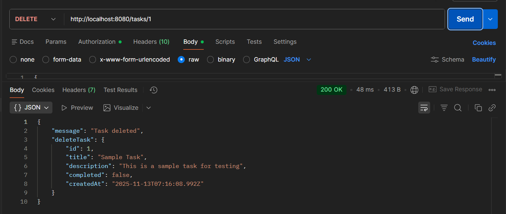


# Osumare Backend Assignment

A polished, production-minded Express.js CRUD API for managing tasks — prepared as an internship assignment submission. This repository demonstrates a clean REST design, basic validation, and an easy-to-run local setup for testing.

Why this project matters

- Simple, well-structured REST endpoints for common CRUD operations.
- Clear input validation and centralized error handling.
- Small, readable codebase that is easy to extend to use a real database.

Key highlights

- Routes: `/tasks` with GET, POST, PUT, DELETE
- Lightweight validation middleware in `middleware/validateTask.js`
- Central error handler in `middleware/errorHandler.js`
- In-memory data store in `data/tasksData.js` (swap in a DB for persistence)

Quick start

```bash
git clone https://github.com/AdinathJabade/osumarebackendassignment.git
cd osumarebackendassignment
npm install
npm start
```

Open the API at: `http://localhost:8080/tasks`

Usage examples (PowerShell / curl)

Get all tasks

```powershell
curl http://localhost:8080/tasks
```

Get single task

```powershell
curl http://localhost:8080/tasks/1
```

Create task

```powershell
curl -Method POST -Body (ConvertTo-Json @{ title = 'New Task'; description = 'Details' }) -ContentType 'application/json' http://localhost:8080/tasks
```

Update task

```powershell
curl -Method PUT -Body (ConvertTo-Json @{ completed = $true }) -ContentType 'application/json' http://localhost:8080/tasks/1
```

Delete task

```powershell
curl -Method DELETE http://localhost:8080/tasks/1
```

API reference (summary)

- GET `/tasks` — list all tasks
- GET `/tasks/:id` — get task by id
- POST `/tasks` — create task (body: `{ title, description }`)
- PUT `/tasks/:id` — update task (body may contain `title`, `description`, `completed`)
- DELETE `/tasks/:id` — delete task

Validation & errors

- POST requires `title` and `description` (non-empty strings).
- PUT requires at least one of `title`, `description`, or `completed` and validates types.
- Uncaught errors are logged and return `{ message: "Internal Server Error" }` with HTTP 500.

Screenshots (manual API tests)

The `apiTestingScreenshot/` folder contains screenshots from manual API tests. Embedded below so reviewers can quickly see the endpoints working.

Get all tasks



Get task by id



Create task



Update task



Delete task



